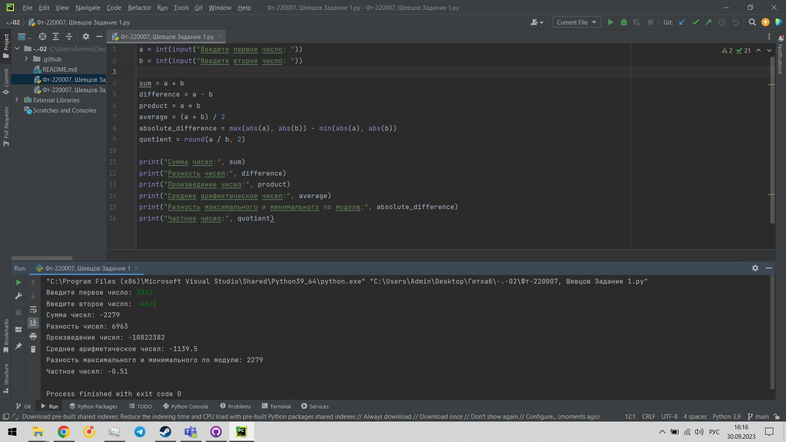

# **Лабораторные**
#### Лабораторные работы по прикладному программированию

# **Исполнитель**
#### Шевцов Михаил
#### Группа ФТ-220007

## **Лабораторная работа №1**
#### *Задание 1:*

##### Написать на любом языке программу: 

##### Пользователь должен ввести 2 числа (например - a, b)
##### Найти и показать на экран:
##### 1. Сумму этих чисел
##### 2. Разность этих чисел
##### 3. Произведение этих чисел
##### 4. Среднее арифметическое этих чисел
##### 5. Разность максимального и минимального по модулю = max(|a|,|b|) - min(|a|,|b|)  

#### Решением является файл Фт-220007, Шевцов Задание 1.py который можно открыть в любом редакторе кода, поддерживающем расширение .py
#### чтобы воспользоваться программой, нужно ввести нужные значения

#### Задание 2:
##### Написать на любом языке программу:
##### 1.Спросите у пользователя имя, возраст, место проживания и страну проживания.
##### 2.Оформите вывод таким образом:
##### Уважаемый <ИМЯ>!На сегодняшний день Вы проживаете в стране <СТРАНА>, в городе <МЕСТО_ПРОЖИВАНИЯ>, и вы родились в <ТАКОМ_ТО_ГОДУ>.

#### Решением является файл Фт-220007, Шевцов Задание 2.py который можно открыть в любом редакторе кода, поддерживающем расширение .py
#### Чтобы воспользоваться программой, необходимо ввести нужные значения 

